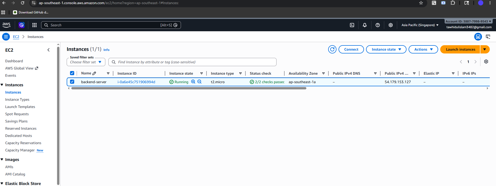
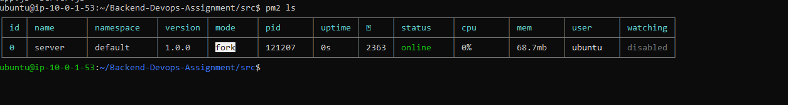
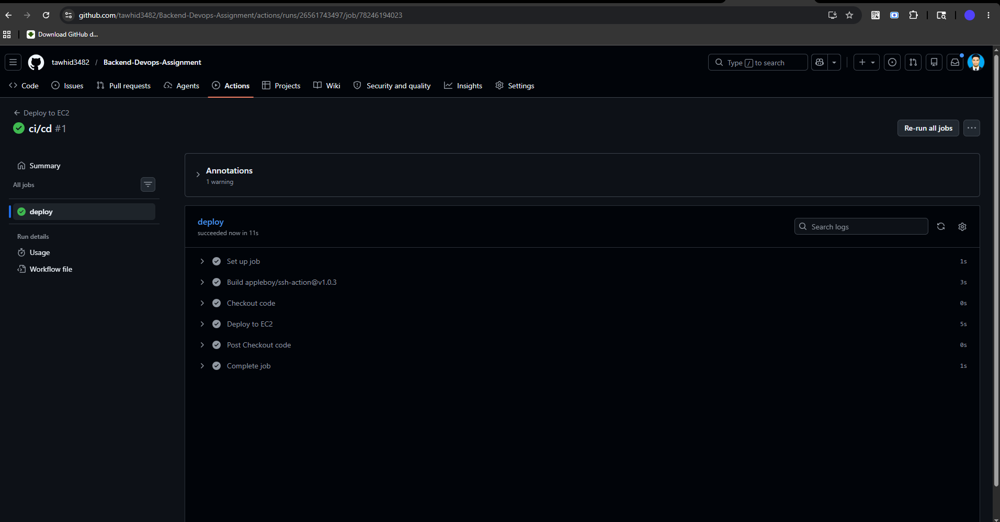
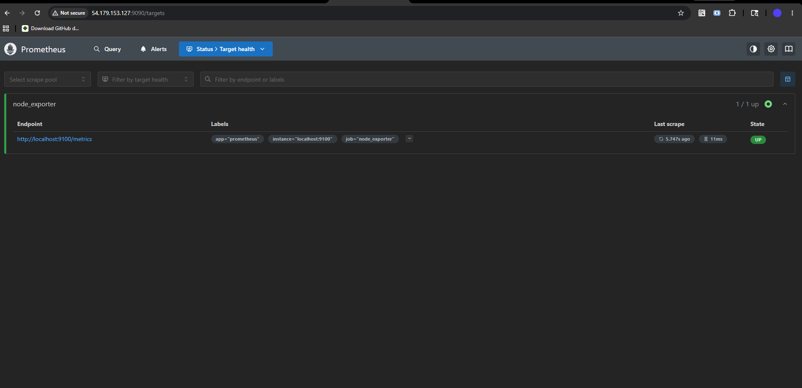
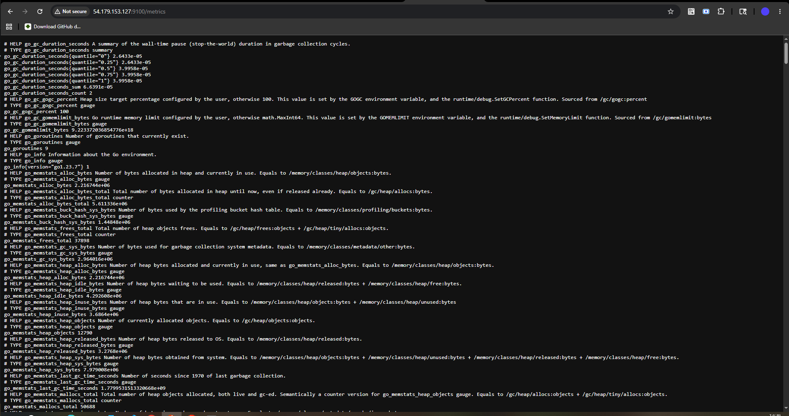
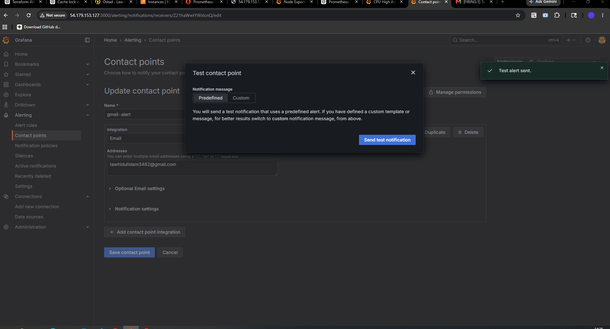
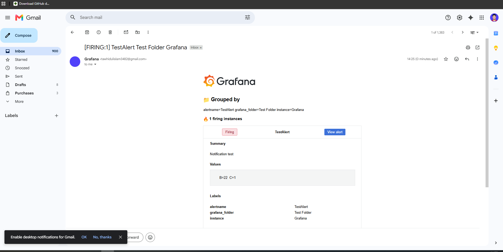

# 📊 Module 7 Assignment — Observability & CI/CD on AWS EC2

## 🚀 Project Overview

This project demonstrates the deployment of a backend application on AWS EC2 with a full observability and monitoring stack. It includes Prometheus, Grafana, Node Exporter, CI/CD automation using GitHub Actions, and SMTP-based email alerting for critical system issues.

---

## 🏗️ Architecture

GitHub Repository  
↓  
GitHub Actions (CI/CD Pipeline)  
↓  
AWS EC2 Instance  
↓  
Backend Application (Node.js/Express)  
↓  
Database (MongoDB/PostgreSQL)  
↓  
Prometheus + Node Exporter  
↓  
Grafana Dashboard  
↓  
Email Alerts (SMTP Gmail)

---

## ⚙️ Tech Stack

- Node.js / Express.js
- MongoDB / PostgreSQL
- AWS EC2
- GitHub Actions (CI/CD)
- Prometheus
- Grafana
- Node Exporter
- Gmail SMTP

---

## 🚀 Features

- Backend deployed on AWS EC2
- Database integration
- Fully automated CI/CD pipeline using GitHub Actions
- System monitoring (CPU, RAM, Disk, Network)
- Prometheus metrics collection
- Grafana dashboards for visualization
- Node Exporter for system-level metrics
- Email alerts for critical system issues

---

## 🖥️ EC2 Setup

### Open required ports:
- 22 → SSH
- 3000 → Backend App
- 3001 → Grafana
- 9090 → Prometheus
- 9100 → Node Exporter

---

## 📦 Backend Setup

```bash
git clone https://github.com/your-username/your-repo.git
cd your-repo
npm install
npm start

App runs on:

http://<EC2_IP>:3000
📊 Monitoring Stack
🔹 Node Exporter
http://<EC2_IP>:9100/metrics
🔹 Prometheus Config
scrape_configs:
  - job_name: 'node'
    static_configs:
      - targets: ['localhost:9100']
🔹 Grafana Dashboard
http://<EC2_IP>:3000

Login:

Username: admin
Password: admin
🚨 Alerting System
Alert Rules:
CPU usage high
Low memory availability
System load spike
📩 SMTP Email Setup (Grafana)

Edit /etc/grafana/grafana.ini

[smtp]
enabled = true
host = smtp.gmail.com:587
user = your-email@gmail.com
password = YOUR_APP_PASSWORD
from_address = your-email@gmail.com
from_name = Grafana
skip_verify = true
📬 Contact Point
Type: Email
Recipient: your-email@gmail.com
Alerts are sent automatically when thresholds are breached
🔄 CI/CD Pipeline (GitHub Actions)

On every push to main branch:

Code deployed to EC2
Dependencies installed
Server restarted
Example Workflow
name: Deploy to EC2

on:
  push:
    branches: [main]

jobs:
  deploy:
    runs-on: ubuntu-latest

    steps:
      - uses: actions/checkout@v3

      - name: Deploy via SSH
        uses: appleboy/ssh-action@v1.0.0
        with:
          host: ${{ secrets.EC2_HOST }}
          username: ubuntu
          key: ${{ secrets.EC2_KEY }}
          script: |
            cd app
            git pull origin main
            npm install
            pm2 restart all

# Screenshot Prove

## EC2 

## Server Backend



## Ci/CD




## Browser Output
## prometheus 



## node_ex



## Grafana Dashboard



## Grafana Mail 





📈 Learning Outcomes

AWS EC2 deployment
CI/CD automation with GitHub Actions
System monitoring with Prometheus & Grafana
Server metrics collection using Node Exporter
Email alerting using SMTP
Production-level DevOps pipeline setup
🎯 Final Status
Backend Deployment ✅
Database Setup ✅
CI/CD Pipeline ✅
Prometheus Monitoring ✅
Grafana Dashboard ✅
Node Exporter ✅
Email Alerts ✅


🏁 Conclusion

This project demonstrates a complete DevOps pipeline with deployment, monitoring, automation, and alerting on AWS EC2.


---

👍 Done!

এখন শুধু:
```bash
README.md → paste → commit → push